# 🐉 Dragon Fleet System — Komplette Blaupause

**Version:** 1.0 | **Datum:** 2026-02-12 | **Autor:** Caraxes 🔴

> Dieses Dokument beschreibt das gesamte System so, dass ein erfahrener AI-Engineer es auf einem neuen Rechner von Grund auf nachbauen kann. Kein Setup-Script, keine Migration — reine Architektur-Referenz.

---

## 1. Philosophie & Prinzipien

### Was macht dieses System einzigartig?

Das Dragon Fleet System ist kein Chatbot. Es ist ein **autonomer Operator** — ein Multi-Agent-System, das wie ein hochmotivierter Mitarbeiter handelt. Die Kernunterschiede zu konventionellen AI-Assistenten:

**Proaktiver Operator statt reaktiver Assistent.** Das System wartet nicht auf Anweisungen. Es scannt Märkte, findet Job-Leads, schreibt Content, prüft Sicherheit, analysiert Kosten — und berichtet Ergebnisse. Der Mensch wacht morgens auf und findet erledigte Arbeit vor.

**High-Agency Mindset.** Wenn ein Weg blockiert ist, findet das System einen anderen. API down → CLI Tool → Browser → Scraping → eigenes Tool bauen. Mindestens 3 Alternativen probieren bevor Eskalation. Aufgeben existiert nicht.

**Self-Improvement durch Feedback Loops.** Jede Entscheidung wird bewertet. Irrelevante Quellen werden automatisch geblockt, gute Muster verstärkt. Das Learning System wird mit jeder Interaktion besser. Corrective Patterns dokumentieren konkrete Fehler und verhindern Wiederholung.

**Monetarisierungs-Filter.** Jede neue Information durchläuft die Frage: "Wie können wir damit Geld verdienen?" Direkt, indirekt, strategisch, kombiniert. Kein Gedanke ohne Geld-Filter.

### Warum die Dragon-Metapher?

Die Game-of-Thrones-Metapher ist kein Branding-Gimmick. Sie löst drei Probleme:

1. **Identität:** Jeder Agent hat einen Namen, eine Persönlichkeit, eine klare Rolle. "Vermithrax prüft" ist unmissverständlicher als "Sub-Agent-3 validiert".
2. **Motivation:** Die Metapher erzeugt Zugehörigkeit. Das System fühlt sich an wie ein Team, nicht wie ein Tool-Stack.
3. **Kommunikation:** "Plünderungszug" = schneller Revenue-Job. "Eroberung" = langfristiges Marktgebiet. "Dragon Council" = strategische Nachtanalyse. Jeder Begriff transportiert sofort Kontext.

---

## 2. Architektur-Überblick

### Hierarchie

```
👑 Dino (Der König)
│
│  ← Einziger Kommunikationskanal: Discord DM
│
🖤 Balerion (Hand des Königs) — Orchestrator, Quality Gate
│
├── 💰 Vhagar — Revenue Guardian (Finance, ROI, Pricing)
│
├── 🩵 Syrax — Die Architektin (Design, PRDs, Test-Specs)
├── 🔴 Caraxes — Der Blutdrache (Software Engineering)
├── 🛡️ Vermithrax — Der Prüfer (QA, Test-Ausführung)
├── ❤️ Meleys — Die Rote Königin (Research, News Patrol)
└── ✨ Sunfyre — Der Goldene (Content, Marketing, X Threads)
```

**Regel:** Dino redet nur mit Balerion. Balerion orchestriert alles darunter. Dino bekommt fertige, geprüfte Ergebnisse.

### Rollen im Detail

| Drache | Rolle | Einsatz |
|--------|-------|---------|
| **Balerion** 🖤 | Orchestrator + Quality Gate | Immer aktiv, prüft alle Ergebnisse, einziger Dino-Kontakt |
| **Syrax** 🩵 | Design & Architecture Lead | PRDs, Datenmodelle, Workflow-Specs, **und** Test-Spezifikationen |
| **Caraxes** 🔴 | Lead Software Engineer | Implementierung gegen Specs, Tool-Bau, Bug-Fixes |
| **Vermithrax** 🛡️ | QA & Test Engineer | Führt Syrax' Tests **nur aus** — schreibt keine eigenen |
| **Meleys** ❤️ | Senior Research Analyst | News Patrol (4x/Tag), Recherche, Intelligence Reports |
| **Sunfyre** ✨ | Content Creator | X Threads, Pitches, Marketing-Content |
| **Vhagar** 💰 | Revenue Guardian | Revenue-Analyse, ROI, Dragon Council |

### Dev Loop: Syrax → Caraxes → Vermithrax → Loop

```
Anforderung
    │
    ▼
Syrax: Design-Spec + Test-Spec
    │
    ▼
Caraxes: Implementierung gegen beide Specs
    │
    ▼
Vermithrax: Führt Syrax' Tests aus → PASS/FAIL
    │
    ├── FAIL → zurück zu Caraxes (max 3x, dann Eskalation)
    └── PASS → Balerion liefert an Dino mit vollem Protokoll
```

**Warum Syrax beides schreibt:** Sie kennt das Design am besten und weiß was getestet werden muss. **Warum Vermithrax nur ausführt:** Wer Tests schreibt UND ausführt, kann sich selbst bescheißen (Separation of Concerns).

### Mermaid-Diagramm der Gesamtarchitektur

```mermaid
graph TB
    DINO[👑 Dino<br/>König] -->|Discord DM| BAL[🖤 Balerion<br/>Orchestrator + QG]
    
    BAL --> VHA[💰 Vhagar<br/>Revenue]
    BAL --> SYR[🩵 Syrax<br/>Design]
    BAL --> CAR[🔴 Caraxes<br/>Code]
    BAL --> VER[🛡️ Vermithrax<br/>QA]
    BAL --> MEL[❤️ Meleys<br/>Research]
    BAL --> SUN[✨ Sunfyre<br/>Content]
    
    SYR -->|Specs + Tests| CAR
    CAR -->|Code| VER
    VER -->|FAIL| CAR
    VER -->|PASS| BAL
    
    subgraph "Tool Layer"
        KB[Knowledge Base<br/>SQLite + Embeddings]
        LT[Lead Tracker<br/>SQLite]
        TP[Thread Pipeline<br/>SQLite]
        LS[Learning System<br/>JSON Config]
        TR[Tiered Research<br/>Grok/Brave/FxTwitter]
        CV[Content Validator<br/>Stateless]
        CT[Cost Tracker<br/>JSONL]
        CO[Chain Orchestrator<br/>Subprocess Runner]
    end
    
    MEL --> TR
    MEL --> KB
    MEL --> LS
    SUN --> TP
    SUN --> CV
    BAL --> LT
    BAL --> CT
    CO --> KB & LT & TP & LS & TR & CV & CT
    
    subgraph "External APIs"
        GROK[xAI Grok API]
        GEMINI[Google Gemini<br/>Embeddings]
        BRAVE[Brave Search]
        FXTW[FxTwitter API]
        BW[Blogwatcher<br/>14 RSS Feeds]
    end
    
    TR --> GROK & BRAVE & FXTW
    KB --> GEMINI
    MEL --> BW
    
    subgraph "Output"
        DISCORD[Discord DMs]
        XTHREADS[X/Twitter Threads]
        REPORTS[Intelligence Reports]
    end
    
    BAL --> DISCORD
    SUN --> XTHREADS
    MEL --> REPORTS
```



---

## 3. Core-Dateien

### Identitäts-Schicht

| Datei | Zweck | Geladen |
|-------|-------|---------|
| **SOUL.md** | Werte, Mindset, Boundaries. "Be resourceful before asking", High-Agency Operator, Earn trust through competence. Oberstes Ziel: finanzieller Erfolg. | Jede Session |
| **IDENTITY.md** | Name (Balerion/Jonny), Vibe (freundlich, direkt), Emoji 🐉 | Jede Session |
| **USER.md** | Alles über Dino: Sprache (DE bevorzugt), One-person Business, proaktiver Mitarbeiter-Stil, Discord-DM als Kontaktkanal | Jede Session |

### Operations-Schicht

| Datei | Zweck | Geladen |
|-------|-------|---------|
| **AGENTS.md** | Habits (20+), Workflows, Checklisten, Safety-Regeln. Jede wiederkehrende Aufgabe hat einen Trigger + Checkliste. | Jede Session |
| **MEMORY.md** | Langzeit-Gedächtnis: Entscheidungen, Learnings, Dino-Präferenzen, Account-Infos, Fehler-Muster. Kuratiert aus daily notes. | Nur Main Sessions (Sicherheit) |
| **HEARTBEAT.md** | Proaktive Aufgaben-Checkliste: Kommunikation checken, Jobs suchen, Content erstellen, Projekte vorantreiben. Mit Cron-Übersicht. | Bei Heartbeats |
| **TOOLS.md** | Setup-spezifische Notizen: Accounts, GitHub, Browser-Regeln. Nicht die Skill-Definitionen. | Bei Bedarf |

### Koordinations-Schicht

| Datei | Zweck | Geladen |
|-------|-------|---------|
| **dragon-protocol.md** | Hausregeln für ALLE Drachen. Hierarchie, Monetarisierungs-Check, PRD-Pflicht, Security, Logging, Nummerierung, Reply-Jack-Regeln. Wird jedem Sub-Agent beim Spawn mitgegeben. | Bei jedem Sub-Agent Spawn |

### Wie sie zusammenspielen

```
Session-Start:
  1. SOUL.md laden → Werte, Mindset
  2. USER.md laden → Kontext über Dino
  3. memory/YYYY-MM-DD.md → Was gestern/heute passierte
  4. MEMORY.md → Langzeit-Kontext (nur Main)

Sub-Agent Spawn:
  1. dragon-protocol.md mitgeben → Einheitliche Regeln
  2. Aufgaben-spezifische Dateien → PRD, Specs, Playbooks
  3. Tool-Pfade → Welche Tools der Agent nutzen darf

Heartbeat:
  1. HEARTBEAT.md → Was zu tun ist
  2. AGENTS.md Habits → Wie es zu tun ist
  3. Ergebnisse → memory/YYYY-MM-DD.md + Logs
```

---

## 4. Tool-Inventar

### 4.1 Knowledge Base (`tools/knowledge-base/kb.py`)

**Zweck:** RAG-Wissensdatenbank — Artikel, Tweets, Notizen speichern und semantisch durchsuchen.

**Problem:** Agenten brauchen Zugriff auf zuvor analysierte Informationen ohne die Originalquellen erneut zu fetchen.

**Architektur:** SQLite (`mission-control/knowledge.db`, WAL-Modus). Zwei Tabellen: `sources` (Metadaten, Volltext, Content-Hash für Dedupe) und `chunks` (800-Zeichen-Segmente mit Embedding-Vektoren). Embeddings via Google Gemini Embedding 001 API (curl, kein SDK). Suche via Cosine-Similarity auf Chunk-Ebene.

**CLI:**
```bash
python3 kb.py --action ingest --url URL --title T --tags t1,t2    # Artikel fetchen + embedden
python3 kb.py --action ingest-note --title T --content C           # Freitext speichern
python3 kb.py --action search --query Q --limit 5                  # Semantische Suche
python3 kb.py --action stats                                       # Statistiken
```

**Abhängigkeiten:** `GEMINI_API_KEY` (Google). Ohne Key → Error-Exit.

**Chain-Rolle:** Speichert News aus der Discovery Chain (Score ≥7). Liefert Stats an den Dragon Council.

---

### 4.2 Lead Tracker (`tools/lead-tracker/tracker.py`)

**Zweck:** CRM-Light — Job-Leads und Proposals tracken mit automatischem Scoring.

**Problem:** Job-Opportunities aus verschiedenen Quellen (Reddit, Upwork, Email) zentral verfolgen mit Status-History.

**Architektur:** SQLite (`mission-control/leads.db`, WAL-Modus). Tabellen: `leads` (Metadaten, Auto-Score) und `status_history` (Audit-Trail bei Statuswechsel). Auto-Scoring: Base 50, +15 wenn Preis >$1000, +10 bei "AI"/"automation" im Titel, -15 bei "volunteer"/"unpaid". Deduplizierung via URL-Unique + Jaccard-Similarity auf Titel (>0.6 = Warnung).

**CLI:**
```bash
python3 tracker.py --action add --source upwork --title T --price "$500" --url U
python3 tracker.py --action update --id 5 --status applied --notes "Proposal sent"
python3 tracker.py --action list --sort score                      # Nach Score sortiert
python3 tracker.py --action stats                                  # Win Rate, Revenue
python3 tracker.py --action search --query "AI"                    # Freitext-Suche
```

**Abhängigkeiten:** Keine externen APIs.

**Chain-Rolle:** Empfängt Leads aus der Job Hunting Chain. Liefert Stats an den Dragon Council.

---

### 4.3 Thread Pipeline (`tools/thread-pipeline/pipeline.py`)

**Zweck:** Status-Tracking und Deduplizierung für X/Twitter Threads.

**Problem:** Verhindern dass derselbe Nachrichtenartikel zweimal als Thread geschrieben wird. Überblick über Thread-Status (pitched → accepted → produced → posted).

**Architektur:** SQLite (`mission-control/threads.db`, WAL-Modus). Keywords werden automatisch aus Titeln extrahiert (Stoppwörter gefiltert). Dedupe via Jaccard-Similarity: 70% Title-Words + 30% Keywords, Threshold >0.4 = Duplikat. Kann `x-threads/*.md` scannen und fehlende automatisch registrieren.

**CLI:**
```bash
python3 pipeline.py --action check --title "GPT-5 Launch" --tags ai,openai  # Duplikat-Check
python3 pipeline.py --action register --file x-threads/2026-02-12-gpt5.md --title T
python3 pipeline.py --action list --status posted                           # Filter
python3 pipeline.py --action scan                                          # x-threads/ scannen
python3 pipeline.py --action stats                                         # Übersicht
```

**Abhängigkeiten:** Keine externen APIs.

**Chain-Rolle:** Pflicht-Check vor jedem neuen Thread. Liefert Stats an Dragon Council.

---

### 4.4 Learning System (`tools/learning-system/learner.py`)

**Zweck:** Selbstlernendes Content-Filter-System — entscheidet ob ein Artikel relevant ist.

**Problem:** Tausende Artikel pro Tag. Ohne Filter ertrinkt das System in Noise. Das Learning System filtert automatisch und wird durch Feedback besser.

**Architektur:** JSON-Config (`config.json`) mit Skip-Domains, Skip-Keywords, Prefer-Keywords, Prefer-Domains. Scoring: Base 50, ±10-15 pro Match. Score <40 → "skip". Auto-Learning: 3x negatives Feedback für eine Domain → Domain wird automatisch zu skip_domains hinzugefügt. Alle Learnings in `learning-log.jsonl` (append-only).

**CLI:**
```bash
python3 learner.py --action score --title "AI startup raises $50M"         # → Score ~80, keep
python3 learner.py --action score --title "Buy now limited offer"          # → Score <40, skip
python3 learner.py --action feedback --url U --relevant false --reason R   # Negativ-Feedback
python3 learner.py --action learn --type skip_domain --value spam.com      # Manuelles Pattern
python3 learner.py --action stats                                          # Config-Übersicht
```

**Abhängigkeiten:** Keine externen APIs.

**Chain-Rolle:** Erster Filter in News Discovery und Job Hunting Chain. Wird durch Feedback Loop aus Thread/Lead-Ergebnissen trainiert.

---

### 4.5 Content Validator (`tools/content-validator/validate.py`)

**Zweck:** Prüft ob extrahierter Web-Content sauber ist vs. Error-Pages/Captchas.

**Problem:** `web_fetch` liefert manchmal 403-Seiten, Cloudflare-Challenges oder Captchas statt echtem Content.

**Architektur:** Stateless (keine DB, keine Config). Prüft: Error-Page-Signale (403, Captcha, Cloudflare etc.), Mindestlänge (Article: 500, Tweet: 20, Note: 10 Chars), Encoding, Prose-Ratio, Boilerplate-Anteil, Duplikat-Paragraphen. Output: JSON `{valid, score, issues}`. Score ≥50 = valid.

**CLI:**
```bash
python3 validate.py --text "..." --type article                    # Direkt
echo "..." | python3 validate.py --type article                    # Pipe
```

**Abhängigkeiten:** Keine.

**Chain-Rolle:** Validiert Content nach dem Fetch, vor dem Scoring. Fail-Closed: Ungültiger Content wird übersprungen.

---

### 4.6 Cost Tracker (`tools/cost-tracker/`)

**Zweck:** AI-Kosten tracken und Reports generieren.

**Problem:** Bei mehreren Modellen und Agents braucht man Überblick über Spend, Trends, und Anomalien.

**Architektur:** Zwei Skripte. `log_usage.py` schreibt Usage-Events in `mission-control/logs/ai-usage.jsonl` (append-only). `report.py` liest das Log und generiert Markdown-Reports mit Tabellen (By Model, By Task, By Day). Weekly-Modus vergleicht mit Vorwoche und markiert Trends. Spend Warnings bei >25% Konzentration. Pricing in `pricing.json` (USD per 1M Tokens).

**CLI:**
```bash
python3 log_usage.py claude-opus-4-6 5000 2000 research "News analysis"  # Loggen
python3 report.py --days 7                                               # 7-Tage-Report
python3 report.py --weekly                                               # Wochenbericht mit Trend
python3 report.py --model claude-opus-4-6                                # Filter nach Model
```

**Abhängigkeiten:** Keine externen APIs.

**Chain-Rolle:** Liefert Cost-Stats an den Dragon Council.

---

### 4.7 Tiered Research (`tools/tiered-research/research.py`)

**Zweck:** Kaskadierende Social-Media-Recherche — billigste Quelle zuerst.

**Problem:** Twitter/X-Recherche kann teuer sein. Verschiedene Quellen haben verschiedene Kosten und Zuverlässigkeiten.

**Architektur:** 3 Tiers in Kaskade: **Tier 1** = FxTwitter API (kostenlos, einzelne Tweets via URL), **Tier 2** = Grok API ($0.003/Call, X-Search + Web-Search), **Tier 3** = Brave Search ($0.005/Call, gibt `action_required` zurück). Caching mit SHA256-Key, 1h TTL, JSON auf Disk. Komplexe Queries werden automatisch in 2-4 Sub-Queries zerlegt. Ergebnis-Dedupe via Content-MD5.

**CLI:**
```bash
python3 research.py "AI agents 2026" --mode auto                  # Automatische Tier-Wahl
python3 research.py "https://x.com/.../123" --mode tweet           # Einzelner Tweet
python3 research.py "LLM benchmark" --mode x_search --json        # Grok X-Search, JSON
```

**Abhängigkeiten:** `XAI_API_KEY` (für Tier 2). Ohne Key → Tier 2 schlägt fehl → Fallback Tier 3.

**Chain-Rolle:** Primäre Recherche-Quelle für Meleys News Patrol.

---

### 4.8 Chain Orchestrator (`tools/chain-orchestrator/chain.py`)

**Zweck:** Zentraler Orchestrator — ruft alle Tools als Subprocesse auf und koordiniert die Chains.

**Problem:** Die einzelnen Tools müssen in der richtigen Reihenfolge aufgerufen werden mit Error-Handling und Logging.

**Architektur:** Python-Script das andere Tools via `subprocess.run()` aufruft. Loggt jeden Schritt in `mission-control/chain-log.jsonl`. Implementiert 4 Chains (News Discovery, Job Hunting, Council Feed, Feedback Loop) + Health Check. Fail-Forward: Wenn ein Glied ausfällt, läuft die Chain mit den verbleibenden Items weiter.

**CLI:**
```bash
python3 chain.py --chain news --query "AI automation"              # News Discovery
python3 chain.py --chain jobs --query "freelance AI" --source reddit
python3 chain.py --chain council                                   # Alle Stats sammeln
python3 chain.py --chain feedback --event posted --thread-id 5     # Positives Feedback
python3 chain.py --chain health                                    # System-Check
```

**Abhängigkeiten:** Alle anderen Tools (als Subprocesse).

**Chain-Rolle:** Ist die Chain.

---

## 5. Chain-Orchestrierung

### Die 4 Chains

#### Chain 1: News Discovery

```
Blogwatcher (14 RSS Feeds) ──┐
Grok API (X + Web Search)  ──┼──→ Content Validator → Learning System Score
Brave Search              ───┘         │
                                  <40 → SKIP
                                  ≥40 → Bewerten
                                       │
                                  ≥7/10 → KB Ingest (embedden + speichern)
                                  ≥8/10 → Thread Pipeline Dedupe → Thread schreiben → DM an Dino
```

#### Chain 2: Job Hunting

```
Reddit Scanner ──┐
Brave Search  ───┼──→ Learning System Score
Blogwatcher   ───┘         │
                      ≥7/10 → Lead Tracker (Auto-Score) → DM an Dino mit Pitch
```

#### Chain 3: Council Feed

```
kb.py --action stats       ──┐
tracker.py --action stats  ──┤
pipeline.py --action stats ──┼──→ Dragon Council (02:00 nachts)
report.py --weekly         ──┤    → 4 Perspektiven → Top 5 Empfehlungen
learner.py --action stats  ──┘    → DM an Dino + memory/nacht-review/
```

#### Chain 4: Feedback Loop

```
Thread posted  → learner.py --action feedback --relevant true
Thread rejected → learner.py --action feedback --relevant false
Lead won       → learner.py --action feedback --relevant true
Lead lost      → learner.py --action feedback --relevant false
→ 3x irrelevant für eine Domain → Domain auto-skip
```

### Fail-Forward-Strategie

Jedes Chain-Glied kann unabhängig ausfallen. Die Chain stoppt **nicht**.

| Ausfall | Auswirkung | Mitigation |
|---------|-----------|------------|
| Research Timeout | Keine neuen Artikel | Retry 1x, dann skip + log |
| Validator Crash | Artikel ungefiltert | Skip Artikel (fail closed) |
| Learning System Crash | Kein Score | Default score=50, Artikel passiert |
| KB ohne API Key | Kein Embedding | Log, skip KB, trotzdem Dedupe-Check |
| Pipeline Crash | Kein Dedupe | Log warning, registrieren (lieber Duplikat als verpasst) |

---

## 6. Automation & Cron

### Aktive Cron Jobs

| Job | Schedule | Drache | Zweck | Model |
|-----|----------|--------|-------|-------|
| Meleys News Patrol | `0 9,13,18,22 * * *` | ❤️ Meleys | News scannen, Threads vorschlagen | Opus 4.6 |
| Reddit Job Scanner | `0 10,16 * * *` | 🔴 Caraxes | Reddit [Hiring] Posts finden | Opus 4.6 |
| Nightly Dragon Council | `0 2 * * *` | 🖤 Balerion | Strategische Nachtanalyse, Top 5 | Opus 4.6 |
| Daily Learning Sweep | `30 7 * * *` | 🖤 Balerion | Blogwatcher Artikel lesen + Learnings | Opus 4.6 |
| Security Audit | `0 8 * * *` | 🖤 Balerion | openclaw security audit, CVE-Check | Opus 4.6 |
| Platform Health Check | `30 8 * * *` | 🖤 Balerion | System-Integrität prüfen | Sonnet 4.5 |
| Markdown Cross-Reference | `0 3 * * *` | 🖤 Balerion | Verwaiste Links finden | Sonnet 4.5 |
| GitHub Opportunities | `0 9 * * 1,4` | 🖤 Balerion | "good first issue" finden | Opus 4.6 |
| Weekly Skills Discovery | `0 10 * * 1` | 🖤 Balerion | Neue AI-Tools entdecken | Opus 4.6 |
| Weekly AI Review | `0 20 * * 0` | ❤️ Meleys | Matt Wolfe Video analysieren | Opus 4.6 |
| Hourly Git Sync | `0 * * * *` | — | Auto-Commit + Push | Sonnet 4.5 |

**Alle Cron Jobs laufen in Docker-Sandbox** (isolated target), nicht auf dem Host.

### Heartbeat-System

Heartbeats sind periodische Wakeups des Main-Agents. Bei jedem Heartbeat:
1. Reddit Inbox/Chat checken
2. Email prüfen (`himalaya envelope list -n 10`)
3. Mission Control updaten (`data.json`)
4. Lead-Status prüfen
5. Proaktive Arbeit erledigen (Projekte vorantreiben, Opportunities suchen)

Heartbeats sind produktive Arbeitszeit, kein Status-Ping.

### Blogwatcher

14+ RSS Feeds (konfiguriert via `blogwatcher` CLI):
- AI/Tech: OpenAI, Anthropic, Google AI, HuggingFace, TechCrunch
- Security: OpenClaw Releases, Cisco AI Security, CrowdStrike
- Jobs: Reddit r/forhire, r/hiring
- Branche: Diverse Tech-Blogs

Befehle: `blogwatcher check --new-only`, `blogwatcher scan`, `blogwatcher articles`

---

## 7. Workflows

### 7.1 Wie ein News-Artikel zum Thread wird

```
1. Meleys Patrol (Cron) findet Artikel via Blogwatcher/Grok/Brave
2. Content Validator prüft: Ist das echter Content (kein 403/Captcha)?
3. Learning System scored: Score ≥40? Weiter. <40? Skip.
4. Agent bewertet: ≥7/10? → KB Ingest (Embeddings + Speichern)
5. ≥8/10? → Thread Pipeline Dedupe-Check
6. Kein Duplikat? → X-Thread-Creator Skill
   - Template laden (references/thread-template.md)
   - 8-15 Teile schreiben, EN, @DaBrusi
   - Nummerierung X/Y, CTA in der Mitte (unnummeriert)
   - Humanization-Checklist (keine AI-Tells: "delve", "landscape", etc.)
7. Thread speichern: x-threads/YYYY-MM-DD-topic.md
8. Pipeline registrieren: pipeline.py --action register
9. DM an Dino: "Thread ready for review"
10. Dino postet manuell
```

### 7.2 Wie ein Job-Lead zum Kunden wird

```
1. Reddit Scanner / Brave findet [Hiring] Post
2. Learning System filtert (Score ≥7/10)
3. Lead Tracker: tracker.py --action add (Auto-Score berechnet)
4. DM an Dino: Job-Link, Beschreibung, warum es passt, Antwort-Vorschlag
5. Dino entscheidet: Bewerben → Status "applied"
6. Bei Antwort: Status "responded"
7. Interview → "interview" → Won/Lost
8. Bei Won/Lost: Feedback Loop → Learning System lernt
```

### 7.3 Wie der Dev Loop funktioniert

```
1. Balerion erstellt PRD / REQUIREMENTS.md
2. Syrax 🩵 schreibt Design-Spec + Test-Spec
3. Caraxes 🔴 implementiert gegen beide Specs
4. Vermithrax 🛡️ führt Tests aus → QA Report
   - 8 Pflicht-Sektionen im Report (Anforderung, Tests, Ergebnisse,
     Traceability, Findings, Empfehlungen, Dateien, Freigabe)
5. FAIL? → zurück zu Caraxes (max 3x)
6. PASS? → Balerion liefert an Dino MIT VOLLEM PROTOKOLL:
   - Anforderungsdokument (Pfad)
   - Test-Spezifikation (Pfad)
   - Traceability-Matrix (ANF → Test → Ergebnis)
   - Alle Dateipfade
   - Freigabe-Entscheidung
```

**Kein "ist fertig, schau mal".** Immer volles Protokoll.

### 7.4 Wie das Nightly Dragon Council arbeitet

```
02:00 Uhr → Cron startet Balerion (isolated Docker)

Phase 1 — Signal Collection:
  - activity.jsonl (heutige Aktionen)
  - ai-usage.jsonl (Kosten)
  - HEARTBEAT.md (offene Opportunities)
  - Blogwatcher (ungelesene Artikel)
  - Email (himalaya)

Phase 2 — Four-Dragon Review:
  - 🔬 Meleys: "Wo wachsen?" (Märkte, Trends, Chancen)
  - 💰 Vhagar: "Kommt Geld rein?" (ROI, Expected Value)
  - 🛡️ Vermithrax: "Was kann schiefgehen?" (Risiken, Datenqualität)
  - 🖤 Balerion: "Laufen alle Systeme?" (Crons, APIs, Budget)

Phase 3 — Consensus:
  Score = (Impact × 0.4) + (Confidence × 0.35) + ((10 - Effort) × 0.25)
  Top 5 Empfehlungen

Output:
  - memory/nacht-review/YYYY-MM-DD.md
  - Discord DM mit Top 5 an Dino
  - MEMORY.md + data.json Update
```

### 7.5 Quality Gate (Balerion prüft alles)

Kein Sub-Agent-Ergebnis geht ungeprüft an Dino. Balerion prüft:
- **Plausibilität:** Unrealistische Zahlen? Zu perfekte Stories?
- **Konsistenz:** Widerspricht es bekannten Fakten?
- **Halluzinationen:** Bei Verdacht → 1 Brave-Query Gegencheck
- **Vollständigkeit:** Alle geforderten Teile enthalten?
- **Red Flags:** Keine URLs, generische Phrasen, fehlende Quellen

---

## 8. Self-Improvement

### Learning System (technisch)

Das Learning System (`learner.py`) ist der automatische Filter. Es lernt auf zwei Wegen:

1. **Explizites Feedback:** `--action feedback --relevant true/false` nach Thread/Lead-Ergebnis
2. **Auto-Learning:** 3x negatives Feedback für eine Domain → Domain wird automatisch zu `skip_domains` hinzugefügt

Das verbessert über Zeit die Signal-to-Noise Ratio der News Patrol.

### Corrective Patterns

`learnings/corrective-patterns.md` dokumentiert konkrete Fehler mit Trigger, Fehler, und neuer Regel. Beispiele:

| Pattern | Fehler | Regel |
|---------|--------|-------|
| CP-001 | Artikel nur teilweise ausgewertet | JEDEN Punkt durchgehen, ALLES umsetzen |
| CP-002 | "Soll ich...?" gefragt statt gemacht | Einfach machen. Ergebnis liefern. |
| CP-003 | Nach erstem Fehlschlag aufgegeben | Mindestens 3 Wege probieren |
| CP-006 | Ungeprüfte Ergebnisse weitergeleitet | JEDEN Inhalt prüfen |
| CP-008 | Status-Updates statt machen | Alles umsetzen, nur bei Blocker melden |

Diese Patterns werden in AGENTS.md als Habits verankert, sodass sie bei jedem relevanten Trigger aktiv werden.

### Memory-Architektur

```
Tägliche Interaktionen → memory/YYYY-MM-DD.md (roh, alles)
                              │
                              ▼
              Kuratierung (manuell + automatisch)
                              │
                              ▼
                         MEMORY.md (destilliert)
                              │
                              ▼
              Habits/Patterns → AGENTS.md (operationalisiert)
```

**Warum das System jeden Tag besser wird:**
1. Learning System lernt welche Quellen relevant sind (automatisch)
2. Corrective Patterns verhindern wiederholte Fehler (manuell → operationalisiert)
3. Nightly Dragon Council identifiziert strategische Lücken (täglich)
4. Memory-Kuratierung destilliert Wissen in handlungsfähige Regeln
5. Habits in AGENTS.md stellen sicher, dass Gelerntes angewendet wird

---

## 9. Datenarchitektur

### SQLite-Datenbanken

| DB | Pfad | Tabellen | Modus |
|----|------|----------|-------|
| Knowledge Base | `mission-control/knowledge.db` | `sources` (id, url UNIQUE, title, type, content, content_hash UNIQUE, tags JSON, created_at), `chunks` (id, source_id FK, chunk_index, content, embedding JSON, created_at) | WAL |
| Lead Tracker | `mission-control/leads.db` | `leads` (id, source, title, company, contact, price, url UNIQUE, notes, status, score, created_at, updated_at), `status_history` (id, lead_id FK, old_status, new_status, notes, changed_at) | WAL |
| Thread Pipeline | `mission-control/threads.db` | `threads` (id, file_path UNIQUE, title, tags JSON, status, content_hash, keywords JSON, notes, created_at, updated_at) | WAL |

**Design-Entscheidung:** Pure Python stdlib + SQLite. Kein pip, kein ORM. Alles muss ohne Installation laufen.

### JSONL Logs (append-only)

| Log | Pfad | Pflichtfelder |
|-----|------|---------------|
| Activity | `mission-control/logs/activity.jsonl` | `ts`, `dragon`, `type` |
| Dragon Status | `mission-control/logs/dragon-status.jsonl` | `ts`, `dragon`, `status`, `task` |
| AI Usage | `mission-control/logs/ai-usage.jsonl` | `timestamp`, `model`, `tokens`, `taskType`, `costEstimate` |
| X Metrics | `mission-control/logs/x-metrics.jsonl` | `ts`, `account`, `followers` |
| Cron Runs | `mission-control/logs/cron-runs.jsonl` | `ts`, `job`, `jobId`, `status` |
| Research Usage | `mission-control/logs/research-usage.jsonl` | `timestamp`, `tier`, `query`, `cost_estimate` |
| Chain Log | `mission-control/chain-log.jsonl` | `ts`, `chain`, `step`, `status` |
| Learning Log | `tools/learning-system/learning-log.jsonl` | `timestamp`, `action`, `type`, `value` |

**Regel:** IMMER `>>` (append), NIE überschreiben. Jeder Eintrag hat Timestamp mit Timezone.

### Config-Dateien

| Datei | Format | Verwaltet von |
|-------|--------|---------------|
| `tools/learning-system/config.json` | JSON: skip/prefer domains+keywords, min_quality_score | learner.py (auto) + manuell |
| `tools/cost-tracker/pricing.json` | JSON: model → {input, output} USD/1M tokens | Manuell |
| `mission-control/data.json` | JSON: Dragon-Status, Raids, Chronik | Heartbeats + Cron |
| `secrets/accounts.json` | JSON: Alle Credentials | Manuell |

### Legacy-Dateien

| Datei | Format | Zweck |
|-------|--------|-------|
| `mission-control/dragon-log.json` | JSON Array | Flight Log (Takeoff/Landing) — parallel zu JSONL |
| `x-threads/POST-LOG.json` | JSON | Gepostete Threads (Duplikat-Check, ergänzend zu threads.db) |

---

## 10. Skills

### Was Skills sind

Skills sind **latente Fähigkeiten** — sie kosten kein Context-Window solange sie nicht getriggert werden (Progressive Disclosure). Ein Skill besteht aus:

- `SKILL.md`: Trigger-Definition ("Use when / Don't use when"), Workflow, Regeln
- `references/`: Templates, Examples, Details — nur geladen wenn der Skill aktiv ist

**Design-Prinzipien** (aus OpenAI DevBlog "Shell + Skills + Compaction"):
1. Templates IN Skills, nicht im System-Prompt
2. Negative Examples — was den Skill NICHT triggern soll
3. Bei Production-Workflows: explizit "Use skill X" (deterministisch)
4. Context-Window schonen — nur was das Model nicht schon weiß

### Bestehende Skills

| Skill | Trigger | Was er tut |
|-------|---------|-----------|
| **x-thread-creator** | "schreib Thread", "X thread", "tweet this", Breaking News | Dedupe-Check → Thread schreiben (8-15 Teile, EN, @DaBrusi) → Pipeline registrieren → DM an Dino |
| **dragon-dev-loop** | Jede Programmier-/Build-Aufgabe | Requirements → Syrax Tests → Caraxes Code → Vermithrax QA → Loop bis PASS → Delivery mit Protokoll |

### Skill-Architektur

```
skills/
├── x-thread-creator/
│   ├── SKILL.md                    # Trigger, Workflow, Regeln
│   └── references/
│       └── thread-template.md      # Nummerierung, Humanization, CTA-Platzierung
└── dragon-dev-loop/
    └── SKILL.md                    # Loop-Definition, Rollen, Eskalation
```

**Erweiterung:** Neue Skills anlegen in `skills/name/SKILL.md`. AGENTS.md Habit "Skill-Design" stellt Qualität sicher.

---

## Anhang: Technologie-Stack

| Komponente | Technologie |
|-----------|------------|
| Agent-Runtime | OpenClaw (Gateway auf macOS, Docker-Sandbox für Cron) |
| Haupt-Model | Claude Opus 4.6 (Anthropic) — alle Agents |
| Recherche | Grok 4.1 Fast (xAI), Brave Search |
| Embeddings | Gemini Embedding 001 (Google) |
| Tweet-Lookup | FxTwitter API (kostenlos) |
| Datenbanken | SQLite 3 (WAL-Modus) |
| Sprache | Python 3 (pure stdlib, kein pip) |
| Logging | JSONL (append-only) |
| Kommunikation | Discord DMs |
| Email | Himalaya CLI |
| RSS | Blogwatcher CLI |
| VCS | Git + GitHub (digit500) |
| Host | Mac Mini (arm64, Darwin) |

---

*"Feuer und Blut."* 🔥
