# OpenClaw Power-User System — Design Specification

**Source:** Matthew Berman "OpenClaw is NUTS" (YouTube, Feb 2026)
**Gist:** https://gist.github.com/mberman84/065631c62d6d8f30ecb14748c00fc6d9
**Version:** 1.0 — 2026-02-12

---

## Table of Contents

1. [System Overview](#1-system-overview)
2. [Interfaces](#2-interfaces)
3. [Data Architecture](#3-data-architecture)
4. [Use Cases](#4-use-cases)
   - [4.1 Personal CRM](#41-personal-crm)
   - [4.2 Knowledge Base (RAG)](#42-knowledge-base-rag)
   - [4.3 Video Idea Pipeline](#43-video-idea-pipeline)
   - [4.4 X/Twitter Tiered Research](#44-xtwitter-tiered-research)
   - [4.5 YouTube Analytics Tracker](#45-youtube-analytics-tracker)
   - [4.6 Business Meta-Analysis (Council)](#46-business-meta-analysis-council)
   - [4.7 HubSpot CRM Operations](#47-hubspot-crm-operations)
   - [4.8 AI Content Humanizer](#48-ai-content-humanizer)
   - [4.9 Image/Video Generation](#49-imagevideo-generation)
   - [4.10 To-Do / Task Management](#410-to-do--task-management)
   - [4.11 Usage & Cost Tracker](#411-usage--cost-tracker)
5. [Automations](#5-automations)
6. [Backup & Restore Strategy](#6-backup--restore-strategy)
7. [Memory Architecture](#7-memory-architecture)
8. [Development Workflow](#8-development-workflow)
9. [Markdown Maintenance](#9-markdown-maintenance)

---

## 1. System Overview

### Hardware

| Component | Role |
|-----------|------|
| **MacBook Air** | Always-on OpenClaw host, clamshell mode, 24/7, never leaves home |
| **Mac Studio** | Primary development machine, used from anywhere |

### Remote Access

| Method | Purpose |
|--------|---------|
| **Tailscale SSH** | Primary remote access, Cursor SSH, terminal ops |
| **TeamViewer** | GUI fallback for direct desktop access |
| **Cursor SSH Remote** | IDE-based development over SSH |

### Models Used

| Provider | Models | Typical Use |
|----------|--------|-------------|
| Anthropic | **Opus 4.6** (primary), Sonnet, Haiku | Council synthesis, complex reasoning, daily ops |
| Google | **Gemini 2.5 Flash** | Classification, cheap tasks, meeting transcript parsing |
| Google | **gemini-embedding-001** | Embeddings (768 dim, free) |
| xAI | **Grok**, **Grok 4-1 fast-reasoning** | X/Twitter search fallback via x-search tool |
| OpenAI | Various | Supplementary tasks |

### Cost Profile

- ~$150/month total (Anthropic subscription + API calls for Gemini, X, etc.)

### Environment Variables (inferred)

```
TWITTERAPI_IO_KEY     # TwitterAPI.io access
X_BEARER_TOKEN        # Official X API v2
XAI_API_KEY           # xAI/Grok API
GOOGLE_API_KEY        # Gemini API
HUBSPOT_API_KEY       # HubSpot CRM
TODOIST_API_TOKEN     # Todoist integration
FATHOM_API_KEY        # Fathom meeting transcripts
GITHUB_TOKEN          # GitHub sync
BRAVE_API_KEY         # Brave Search
FIRECRAWL_API_KEY     # Firecrawl content extraction
```

---

## 2. Interfaces

### Primary: Telegram (Topic-Routed)

Telegram is the primary command and reporting interface. Uses **topic groups** — each topic is a narrow, dedicated channel:

- Knowledge Base
- Food Journal
- Cron Updates
- Video Research
- Self-Improvement
- Business Analysis
- Meeting Prep
- Images
- Video Generation
- *(and more)*

**Key configuration:** Session expiration set to **1 year** (overriding default daily reset). This preserves context within each topic indefinitely.

### Secondary: Slack

- Available in **2 channels only**
- Restricted to Berman only (other users' invocations are ignored)
- Used for team communication about video ideas
- OpenClaw posts KB articles to Slack automatically
- Team can tag OpenClaw to trigger video idea pipeline

### CLI / SSH

- Direct terminal access via Tailscale SSH
- Used for: tailing logs, querying cron DB, restarting services, development

### Scripts

- Cron-triggered automation scripts
- Validation scripts for development

---

## 3. Data Architecture

### Pattern: SQLite + Vector Column (Hybrid)

Every data store follows a standardized pattern:

```
┌─────────────────────────────────────────┐
│           SQLite Database               │
│  ┌──────────┬──────────┬─────────────┐  │
│  │ Standard │ Standard │  Vector     │  │
│  │ Columns  │ Columns  │  Column     │  │
│  │ (SQL)    │ (SQL)    │  (Embedding)│  │
│  └──────────┴──────────┴─────────────┘  │
│  WAL mode + Foreign Keys enabled        │
└─────────────────────────────────────────┘
```

- **SQL columns**: Traditional queries, filtering, joins, scoring
- **Vector column**: Natural language / semantic search via cosine similarity
- **Embeddings**: Gemini `gemini-embedding-001` (768 dimensions, free)
- **Fallback**: OpenAI `text-embedding-3-small` (1536 dimensions)
- **Concurrency**: Lock-file with stale PID check + 15min timeout

### Databases

| Database | Content |
|----------|---------|
| CRM Contacts | People, companies, timeline, scores, embeddings |
| Knowledge Base | Articles, chunks, embeddings, metadata |
| Video Pitches | Ideas, status, similarity scores, sources |
| Business Analysis | Signals, council traces, scores |
| Analytics | YouTube metrics time-series, competitor data |
| Cron Log | Job executions, status, summaries |
| Usage/Cost | API calls, tokens, costs, task types |

### Deduplication Strategies

- **CRM**: Email match + Name+Company combo match
- **Knowledge Base**: URL normalization (strip utm_, www., twitter→x.com) + SHA-256 content hash
- **Video Pitches**: Hybrid similarity (70% semantic + 30% keyword), reject threshold >40%

---

## 4. Use Cases

### 4.1 Personal CRM

**Purpose:** Maintain a living database of all professional contacts, enriched from email and calendar, queryable in natural language.

**Trigger:** Daily cron job

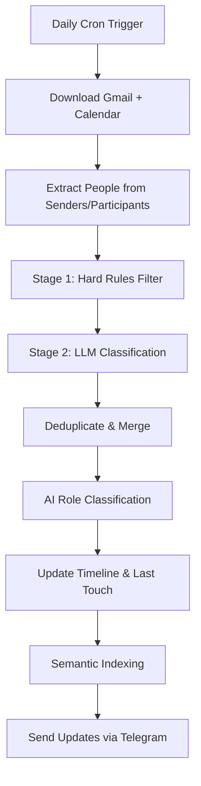

**Model Assignment:**
- Classification: **Gemini 2.5 Flash** (cheap, fast)
- Semantic indexing: **gemini-embedding-001** (free)

**Data Flow:**
- Gmail API → raw emails → parsed contacts
- Google Calendar API → events → participants
- Dedup: email + name+company combo
- Contact scoring: +5/exchange, +15 CEO/Founder title, +25 email+calendar overlap
- Learning system: `learning.json` with `skip_domains`, `prefer_titles`, `skip_keywords`

**APIs:**
- Google Workspace (via `gog`): Gmail + Calendar ingestion
- Telegram: notification delivery

**Sub-workflow — Meeting Prep:**
1. Daily morning cron
2. Read today's calendar
3. Filter: remove events without external attendees
4. For each meeting: query CRM for attendee history
5. Generate prep brief: who they are, last conversation, meeting agenda
6. Deliver to Telegram

---

### 4.2 Knowledge Base (RAG)

**Purpose:** Persistent, searchable repository of everything interesting found on the web. Enables natural language retrieval across all saved content.

**Trigger:** Manual (drop URL/file in Telegram)

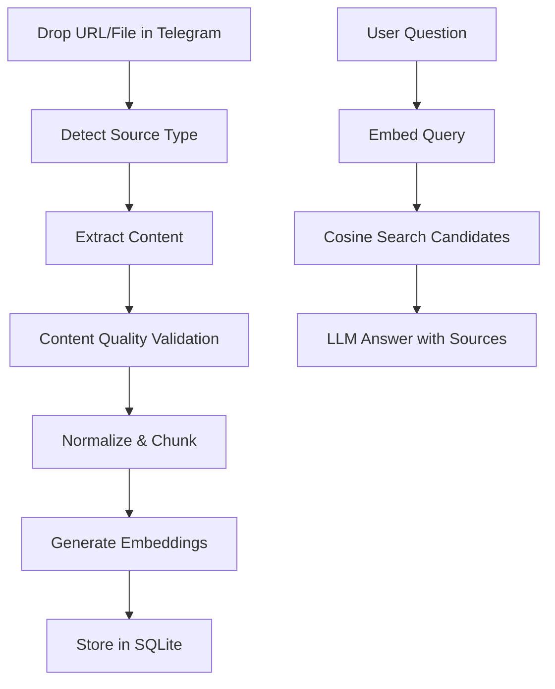

**Content Extraction Fallback Chain:**
1. Readability parser
2. Firecrawl
3. Headless browser
4. Raw HTTP

**Content Quality Validation:**
- Minimum 20 characters
- Minimum 15% of lines >80 chars (prose detection)
- Error page detection (2+ signals: "access denied", "captcha", etc.)

**Chunking Parameters:**
- 800 characters per chunk
- 200 character overlap
- Minimum 100 characters per chunk
- Split on sentence boundaries

**Embeddings:** Gemini `gemini-embedding-001` (768 dim, free)

**Deduplication:**
- URL normalization (strip utm_ params, www., normalize twitter→x.com)
- SHA-256 content hash

**Side Effect:** When article is saved, automatically posts summary to Slack team channel.

---

### 4.3 Video Idea Pipeline

**Purpose:** Automate the entire flow from "interesting topic" to "researched Asana card with hooks, outline, and sources."

**Triggers:**
- Drop link in Telegram
- Tag OpenClaw in Slack with a topic

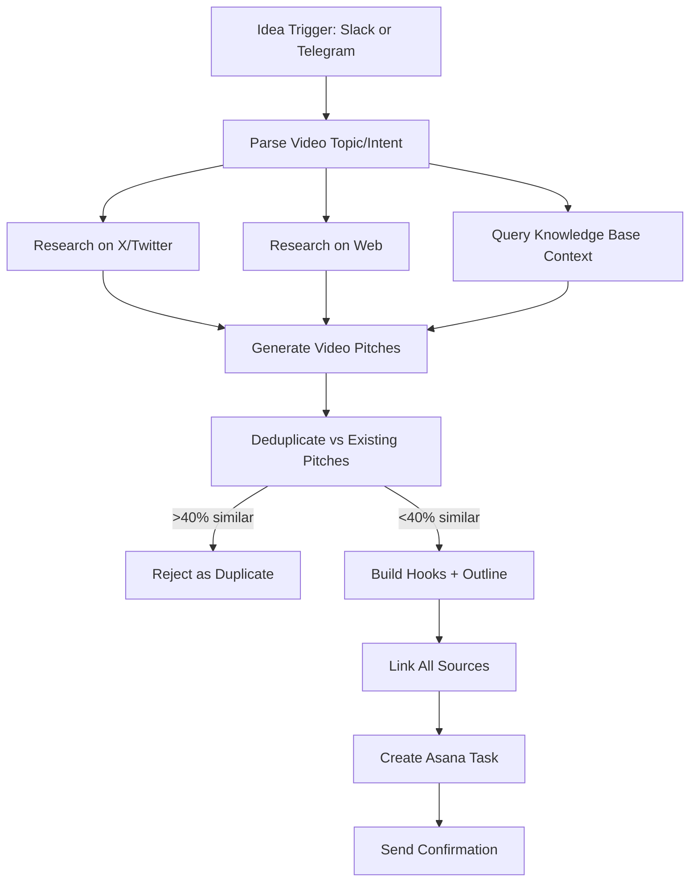

**Similarity Check:**
- 70% semantic (embedding cosine)
- 30% keyword (title 30%, summary 20%, tags 20%)
- Hard gate: >40% = automatic rejection

**Status Tracking:** `pitched → accepted → rejected → produced → duplicate`

**ID Format:** `YYYY-MM-DD-NNN`

**Model Assignment:**
- Research synthesis: Opus 4.6
- Embedding: gemini-embedding-001

**APIs:** X/Twitter (tiered), Brave Search, Knowledge Base (internal), Asana API

---

### 4.4 X/Twitter Tiered Research

**Purpose:** Cost-optimized Twitter/X data retrieval with automatic fallback through progressively more expensive tiers.

**Trigger:** Called by other workflows (Video Pipeline, Business Analysis, ad-hoc queries)

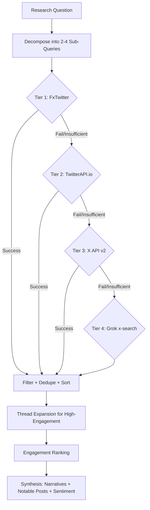

**Tier Details:**

| Tier | Service | Endpoint | Cost | Capability |
|------|---------|----------|------|------------|
| 1 | FxTwitter | `api.fxtwitter.com` | Free | Single tweet lookup only |
| 2 | TwitterAPI.io | `api.twitterapi.io` | $0.15/1k tweets | Search, profiles, user tweets, thread context |
| 3 | X API v2 | `api.x.com/2/` | $0.005/tweet | Full API, 350ms rate limit |
| 4 | Grok x-search | `api.x.ai/v1/responses` | Per-token | Model: `grok-4-1-fast-reasoning` |

**Env Vars:** `TWITTERAPI_IO_KEY`, `X_BEARER_TOKEN`, xAI API key

**Query Decomposition:** Break complex questions into 2-4 focused sub-queries covering different angles.

**Post-Processing:**
- Remove retweets, suppress low-quality
- Engagement ranking: likes + retweets + replies (weighted)
- Output: 3-5 key narratives, 5-10 notable posts, sentiment summary, contrarian takes

---

### 4.5 YouTube Analytics Tracker

**Purpose:** Daily collection of channel metrics and competitor intelligence, stored as time-series for trend analysis.

**Trigger:** Daily cron job

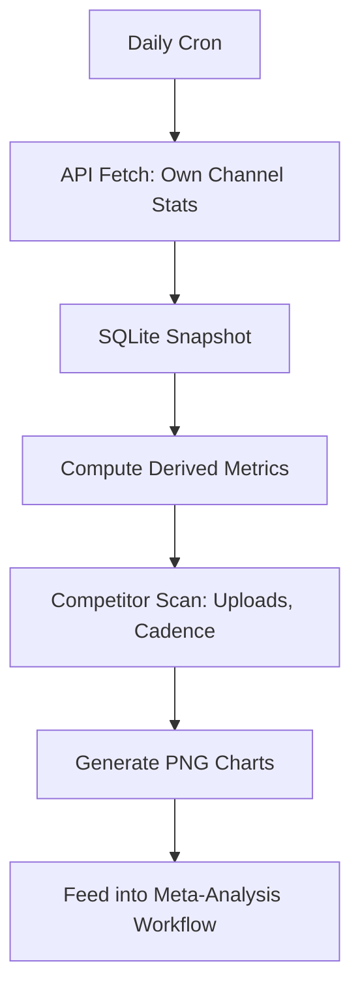

**Data Stored:**
- Per-video stats (views, likes, comments)
- Channel growth metrics
- Competitor upload cadence and view momentum
- 7-day moving averages

**Chart Generation:** Dark-theme PNGs (matplotlib)

**Model Assignment:** Gemini 2.5 Flash for metric computation

**APIs:** YouTube Data API v3

**Output feeds into:** Business Meta-Analysis (Use Case 4.6)

---

### 4.6 Business Meta-Analysis (Council)

**Purpose:** Daily AI-driven business review using a multi-agent council that ingests all available signals, debates, and produces prioritized actionable insights.

**Trigger:** Daily cron (runs at night during low-usage hours)

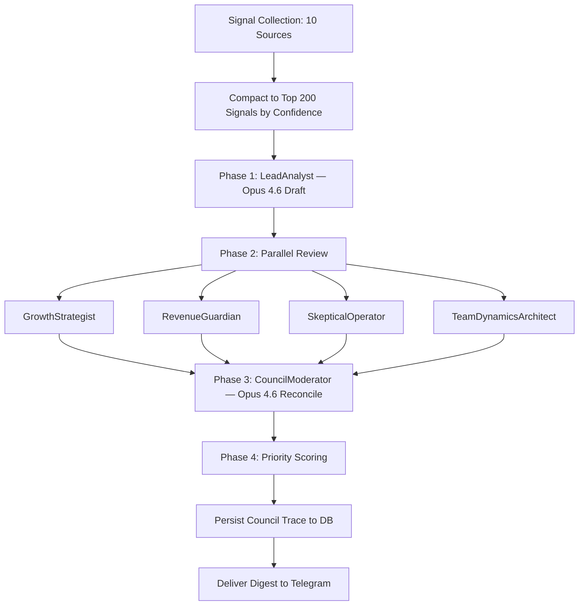

**10 Signal Sources:**

1. YouTube Metrics (from Analytics Tracker)
2. CRM Health (from Personal CRM)
3. Cron Reliability (from Cron Log DB)
4. Social Growth (X/Twitter metrics)
5. Slack Activity (message volume, themes)
6. Email Themes (from Gmail ingestion)
7. Asana Backlog (task counts, ages)
8. X/Twitter Trends (from Tiered Research)
9. Fathom Meetings (transcripts, action items)
10. HubSpot Pipeline (deal stages, values)

**Signal Format:**
```json
{ "source": "youtube", "signal_name": "views_7d", "value": 150000, "confidence": 90, "direction": "up", "category": "growth" }
```

**Priority Score Formula:**
```
Priority = (impact × 0.40) + (confidence × 0.35) + ((100 - effort) × 0.25)
```

**Council Personas:**

| Role | Mandate |
|------|---------|
| LeadAnalyst (Opus 4.6) | Initial draft analysis |
| GrowthStrategist | Growth opportunities |
| RevenueGuardian | Revenue protection & optimization |
| SkepticalOperator | Challenge assumptions, find risks |
| TeamDynamicsArchitect | Team/people considerations |
| CouncilModerator (Opus 4.6) | Reconcile disagreements, final synthesis |

**Hard Constraint:** No "publish now" recommendations (prevents premature content pushes).

**Audit Trail:** Full trace stored: draft + all reviews + consensus + final scores.

**Weight Learning:** Weights adapt based on user feedback (accept/reject recommendations).

---

### 4.7 HubSpot CRM Operations

**Purpose:** Natural language interface to HubSpot for managing the deal pipeline (primarily sponsorships).

**Trigger:** Manual (natural language request)

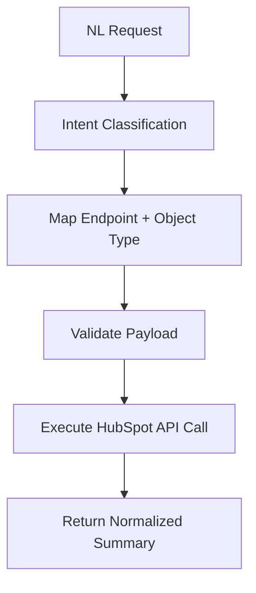

**Intent Types:** Lookup, Create, Update, List, Associate

**Validation:** Missing required fields detected and requested interactively.

**API:** HubSpot API (via `HUBSPOT_API_KEY`)

**Output:** Human-readable summaries, never raw JSON.

---

### 4.8 AI Content Humanizer

**Purpose:** Remove AI-characteristic patterns from all generated text. Applied globally across all outputs.

**Trigger:** Always active (applied to all text output)

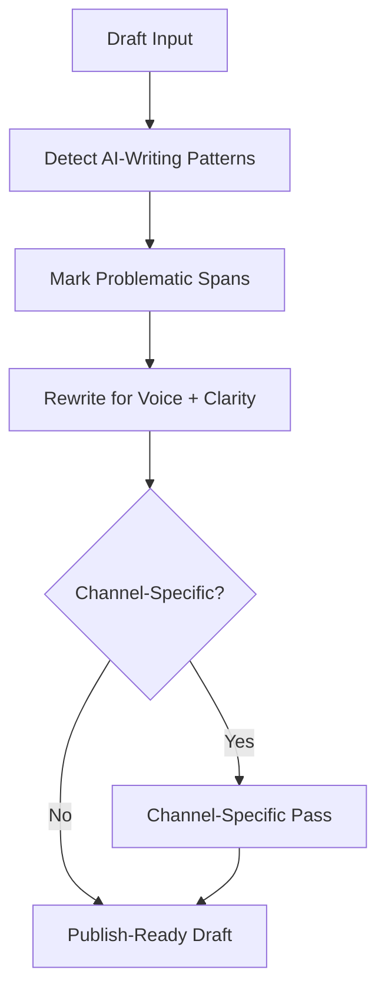

**Detection Rules (7 categories):**

1. **Overuse words:** delve, landscape, leverage, "it's important to note", game-changing, revolutionary, transformative
2. **Tone inflation:** Dramatic language disproportionate to topic
3. **Generic phrasing:** Sentences that fit any topic
4. **Repetitive structures:** Same sentence openings
5. **Excessive hedging:** "It's worth noting that perhaps..."
6. **Too-clean lists:** Over-parallel, no personality
7. **Identical paragraph lengths:** No rhythm variation

**Rewrite Rules:**
- Use contractions (it's, don't, won't)
- Mix sentence lengths (short punchy + long explanatory)
- Allow sentence fragments
- Remove filler, keep substance
- Human cadence — not errors, but natural rhythm

**Channel Tuning:**

| Channel | Style |
|---------|-------|
| Twitter/X | Punchy, <280 chars, direct |
| LinkedIn | Professional but conversational |
| Blog | Longer form, anecdotes OK |
| Email | Brief, clear, action-oriented |

**Source:** Available on ClawHub as downloadable skill.

---

### 4.9 Image/Video Generation

**Purpose:** On-demand image and video creation through Telegram, with iterative editing.

**Trigger:** Manual (Telegram topics: Images, Video)

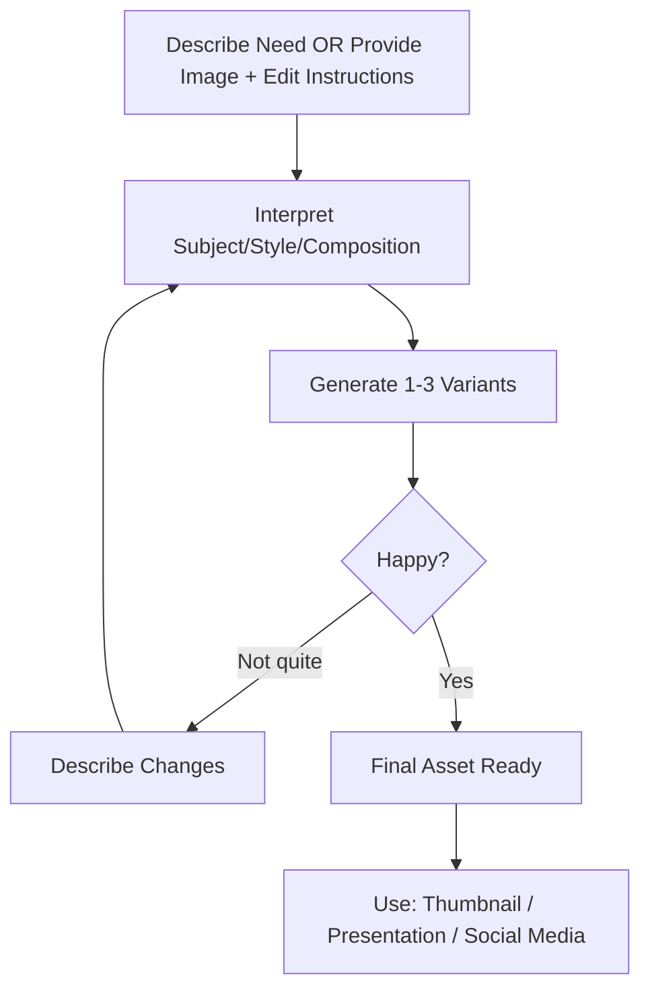

**APIs:**
- **Nano Banana** — Image generation API
- **VO** — Video generation API

**Capabilities:** Text-to-image, image editing, inpainting/img2img, video generation

**Context:** Session maintains editing history for iterative refinement within same Telegram topic.

---

### 4.10 To-Do / Task Management

**Purpose:** Extract action items from meetings and conversations, cross-reference with CRM, and push approved tasks to Todoist.

**Triggers:**
1. Meeting happens → Fathom transcript available
2. Manual: "Add task to follow up with X by Friday"
3. Planning session

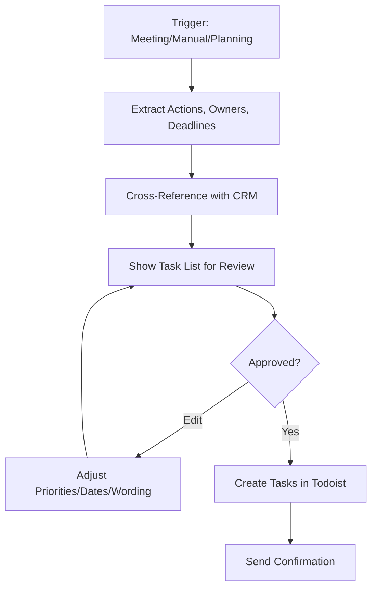

**Model Assignment:**
- Meeting transcript parsing: **Gemini 2.5 Flash** (cheap, fast)
- Extracts: key takeaways for user + takeaways for attendees

**is_owner flag:** Distinguishes user's tasks from attendee tasks.

**CRM Cross-Reference:** Mentioned names matched against contact database for context enrichment.

**APIs:**
- Fathom API — meeting transcripts
- Todoist API — task creation
- CRM (internal) — contact lookup

---

### 4.11 Usage & Cost Tracker

**Purpose:** Log every AI and API call with cost data, enabling spend analysis and optimization recommendations.

**Trigger:** Passive (runs on every API call) + Manual queries

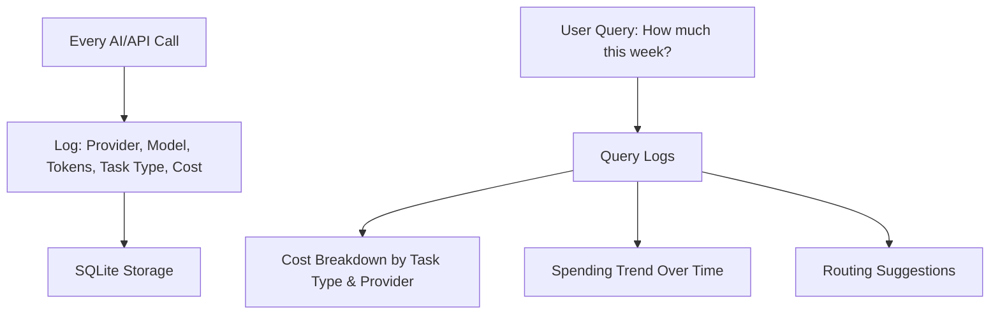

**Logged Fields:** Provider, model, tokens, task type, cost, timestamp

**Analysis Capabilities:**
- Cost breakdown by task type and provider
- 30/90-day spending trends
- >25% spend warning (flags workflows consuming disproportionate budget)
- Routing suggestions: use cheaper models for simple tasks
- Caching suggestions: detect repeated queries

**Output:** On-demand via Telegram query

---

## 5. Automations

### Every Hour
| Job | Description |
|-----|-------------|
| Code Repo Sync | Git push all code + markdown to GitHub |
| CRM Change Check | Monitor for new contacts or updates |
| Signal Scouting | Check for new signals across sources |

### Every Day
| Job | Description |
|-----|-------------|
| Email + Calendar Ingestion | Download Gmail + Calendar → CRM |
| YouTube Analytics Collection | Own channel + competitor data |
| Platform Health Checks | Verify all integrations operational |
| Nightly Business Briefing | Council meta-analysis → Telegram digest |
| Meeting Prep | Morning calendar review → prep briefs |
| Markdown Maintenance | Cross-reference files against best practices |

### Every Week
| Job | Description |
|-----|-------------|
| Memory Synthesis | Daily notes → long-term memory |
| Planning + Reminders | Review upcoming commitments |
| Housekeeping | Cleanup, pruning, audits |

### Every Job (Universal Pattern)
```
Log start → Execute task → Log end with status+summary → Notify Telegram (success or failure)
```

All cron results are stored in the Cron Log database.

---

## 6. Backup & Restore Strategy

### What Gets Protected
- CRM database
- Knowledge Base
- Video Pitch DB
- Business Analysis / Council traces
- Analytics time-series
- Cron Logs

### Backup Destinations

| Type | Destination | Frequency |
|------|-------------|-----------|
| Code + Markdown | GitHub | Hourly (auto git push) |
| Databases | Google Drive | Daily (timestamped + manifest) |

### Google Drive Retention
- Timestamped packages with manifest
- Old backups auto-pruned (retention policy)

### Restore Procedure
1. Pull backup from Google Drive
2. Restore files to original paths
3. Verify: CRM, Knowledge Base, gateway, cron jobs
4. Back online

A detailed restore document is maintained.

---

## 7. Memory Architecture

Uses OpenClaw's **default built-in memory** (not QMD).

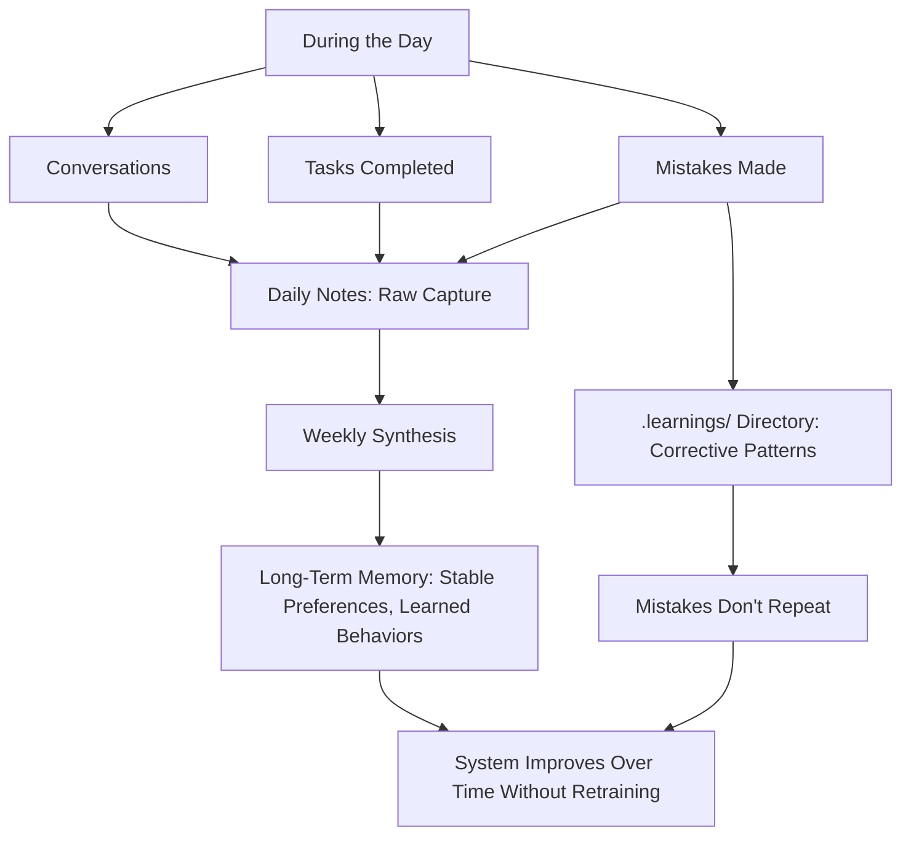

### Layers

| Layer | Content | Cadence |
|-------|---------|---------|
| Daily Notes | Raw capture of everything | Continuous |
| Weekly Synthesis | Distilled patterns and preferences | Weekly cron |
| Long-Term Memory | Stable preferences, learned behaviors | Accumulated |
| `.learnings/` | Corrective patterns so mistakes don't repeat | On error |

---

## 8. Development Workflow

### Physical Setup

```
Mac Studio (anywhere)
    ├── Cursor SSH Remote ──┐
    ├── Direct SSH Terminal ─┼──→ MacBook Air (always-on at home)
    └── TeamViewer fallback ─┘     └── OpenClaw runs 24/7
```

### Development Flow

1. **Isolate:** Work in isolated git worktree (changes don't affect live system)
2. **Edit:** Targeted changes — new skills, prompt tweaks, bug fixes
3. **Validate:** Run validation scripts, check logs, verify behavior
4. **Commit:** Hourly auto-push or manual commit + sync

### Repository Strategy

- Separate git repos for major projects (e.g., CRM) and OpenClaw as a whole
- Tests written for everything
- Frequent commits pushed to GitHub

### Fast Ops (SSH Terminal)

- Tail logs
- Query cron database
- Restart services

**Key principle:** Live runtime stays stable throughout development.

---

## 9. Markdown Maintenance

### The Problem
Multiple markdown files (skills, memory, workspace.md) can drift out of sync and degrade over time.

### The Solution: Daily Maintenance Cron

1. Downloaded OpenClaw best practices from `openclaw.com` → stored locally
2. Downloaded Anthropic's Opus 4.6 prompting guide → stored locally
3. Daily cron: cross-reference **all markdown files** against both:
   - OpenClaw best practices
   - Anthropic prompting best practices
4. Auto-update and clean files

### Key Insight (Opus 4.6)
> "Opus 4.6 really listens to every single word — you don't need bold, all caps, 'don't ever forget this'. Very different from Opus 4.5."

### workspace.md
A large reference file with table of contents specifying how everything works. Serves as the central configuration document for the entire system.
