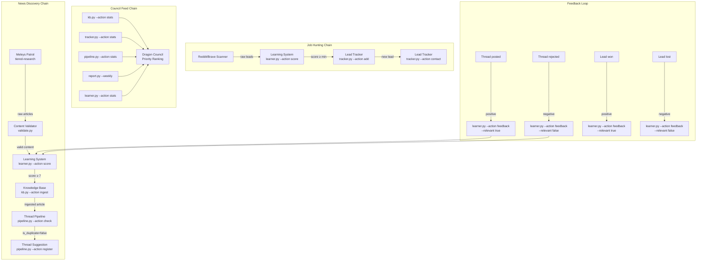

# 🩵 Tool-Chain Design Spec — Cross-Workflow Integration

**Author:** Syrax 🩵 — Die Architektin  
**Date:** 2026-02-12  
**Status:** READY FOR IMPLEMENTATION  
**Implementor:** Caraxes 🔴 | **Tester:** Vermithrax 🛡️

---

## 1. Architektur-Überblick



---

## 2. Chain-Spezifikationen

### 2.1 News Discovery Chain

**Trigger:** Cron Job (Meleys Patrol, z.B. alle 4h)

| Step | Tool | CLI Command | Input | Output | Fail Behavior |
|------|------|-------------|-------|--------|---------------|
| 1 | tiered-research | `python3 research.py "AI automation news" --mode x_search --json` | Query string | JSON mit articles | Skip chain, log error |
| 2 | content-validator | `python3 validate.py --text "$CONTENT" --type article` | Article text | `{valid, score, issues}` | Skip article, continue |
| 3 | learning-system | `python3 learner.py --action score --title "$TITLE" --url "$URL" --text "$TEXT"` | Title, URL, text | `{score, signals, action}` | Use score=50 default |
| 4 | knowledge-base | `python3 kb.py --action ingest --url "$URL" --title "$TITLE" --tags "$TAGS"` | URL, title, tags | "✅ Ingested" or "DUPLICATE" | Log, continue |
| 5 | thread-pipeline | `python3 pipeline.py --action check --title "$TITLE" --tags "$TAGS"` | Title, tags | `{is_duplicate, matches}` | Assume not duplicate |
| 6 | thread-pipeline | `python3 pipeline.py --action register --file "$FILE" --title "$TITLE" --tags "$TAGS" --status pitched` | File path, title | "✅ Registered" | Log error |

**Orchestrator-Logik (Pseudocode):**

```python
def news_discovery_chain(query: str) -> list[dict]:
    """Returns list of thread suggestions."""
    results = research(query, mode="x_search")  # Step 1
    suggestions = []
    
    for article in extract_articles(results):
        # Step 2: Validate
        validation = validate_content(article["text"], "article")
        if not validation["valid"]:
            log_skip(article, "validation_failed", validation["issues"])
            continue
        
        # Step 3: Score
        score_result = score_content(cfg, article["title"], article["url"], article["text"])
        if score_result["score"] < 70:  # min_quality = 70 (maps to ≥7 on 1-10 scale)
            log_skip(article, "low_score", score_result)
            continue
        
        # Step 4: Ingest to KB
        ingest_result = kb_ingest(article["url"], article["title"], article["tags"])
        if "DUPLICATE" in ingest_result:
            continue
        
        # Step 5: Dedupe check
        dedupe = pipeline_check(article["title"], article["tags"])
        if dedupe["is_duplicate"]:
            log_skip(article, "duplicate_thread", dedupe["matches"])
            continue
        
        # Step 6: Register as thread suggestion
        suggestions.append(article)
    
    return suggestions
```

---

### 2.2 Job Hunting Chain

**Trigger:** Cron Job (Job Scanner, z.B. 2x täglich)

| Step | Tool | CLI Command | Input | Output | Fail Behavior |
|------|------|-------------|-------|--------|---------------|
| 1 | Brave/Reddit | `web_search("freelance AI developer reddit")` | Query | Search results | Skip chain |
| 2 | learning-system | `python3 learner.py --action score --title "$TITLE" --url "$URL"` | Title, URL | `{score, action}` | Use score=50 |
| 3 | lead-tracker | `python3 tracker.py --action add --source reddit --title "$TITLE" --url "$URL" --price "$PRICE"` | Lead info | Lead ID | Log duplicate |
| 4 | lead-tracker | `python3 tracker.py --action contact --id $ID --contact-type note --notes "Auto-discovered via $SOURCE"` | Lead ID | "✅ Contact event" | Non-critical |

**Orchestrator-Logik:**

```python
def job_hunting_chain(query: str, source: str = "reddit") -> list[int]:
    """Returns list of new lead IDs."""
    results = web_search(query)  # or reddit scrape
    lead_ids = []
    
    for job in extract_jobs(results):
        # Step 2: Pre-filter
        score = score_content(cfg, job["title"], job["url"], job.get("text", ""))
        if score["action"] == "skip":
            continue
        
        # Step 3: Add lead
        lead_id = add_lead(source, job["title"], job.get("price"), job["url"])
        if lead_id is None:  # duplicate
            continue
        
        # Step 4: Auto-log discovery
        add_contact(lead_id, "note", f"Auto-discovered via {source} search")
        lead_ids.append(lead_id)
    
    return lead_ids
```

---

### 2.3 Council Feed Chain

**Trigger:** Dragon Council Session (on-demand or scheduled)

| Signal Source | CLI Command | Output Key |
|---------------|-------------|------------|
| KB | `python3 kb.py --action stats` | sources_count, chunks_count, size_kb |
| Leads | `python3 tracker.py --action stats` | total, applied, won, win_rate |
| Threads | `python3 pipeline.py --action stats` | total, by_status, last_30_days |
| Costs | `python3 report.py --weekly` | total_cost, trend, warnings |
| Learning | `python3 learner.py --action stats` | skip_domains, prefer_keywords, recent_learnings |

**Council Signal Aggregator (neue Funktion):**

```python
def council_feed() -> dict:
    """Collect all system signals for Dragon Council."""
    return {
        "kb": run_capture("python3 kb.py --action stats"),
        "leads": run_capture("python3 tracker.py --action stats"),
        "threads": run_capture("python3 pipeline.py --action stats"),
        "costs": run_capture("python3 report.py --weekly"),
        "learning": run_capture("python3 learner.py --action stats"),
        "timestamp": datetime.utcnow().isoformat()
    }
```

---

### 2.4 Feedback Loop

**Trigger:** Status-Änderung in Thread Pipeline oder Lead Tracker

| Event | Feedback Call |
|-------|-------------|
| Thread status → `posted` | `python3 learner.py --action feedback --url "$SOURCE_URL" --title "$TITLE" --relevant true --reason "Thread posted successfully"` |
| Thread status → `rejected` | `python3 learner.py --action feedback --url "$SOURCE_URL" --title "$TITLE" --relevant false --reason "Thread rejected: $REASON"` |
| Lead status → `won` | `python3 learner.py --action feedback --url "$URL" --title "$TITLE" --relevant true --reason "Lead won"` |
| Lead status → `lost` | `python3 learner.py --action feedback --url "$URL" --title "$TITLE" --relevant false --reason "Lead lost: $REASON"` |

---

## 3. Datenfluss-Diagramm

```
┌─────────────────────────────────────────────────────────────────────┐
│                        DATENBANKEN                                   │
│                                                                       │
│  mission-control/knowledge.db  ←── kb.py (write: ingest)             │
│       ↑ read: search, list, stats    └── sources, chunks tables      │
│                                                                       │
│  mission-control/leads.db      ←── tracker.py (write: add, update)   │
│       ↑ read: list, stats, search    └── leads, status_history,      │
│                                          contact_history tables       │
│                                                                       │
│  mission-control/threads.db    ←── pipeline.py (write: register,     │
│       ↑ read: check, list, stats         update, scan)               │
│                                  └── threads table                    │
│                                                                       │
│  learning-system/config.json   ←── learner.py (write: learn,        │
│       ↑ read: score, bulk-score          feedback auto_learn)        │
│                                                                       │
│  learning-system/learning-log.jsonl ←── learner.py (append: all)     │
│                                                                       │
│  mission-control/logs/ai-usage.jsonl ←── report.py (read)            │
│  mission-control/logs/research-usage.jsonl ←── research.py (append)  │
│                                                                       │
│  NEW: mission-control/chain-log.jsonl ←── chain.py (append: all)     │
└─────────────────────────────────────────────────────────────────────┘
```

**Wer schreibt wohin, wer liest woher:**

| Tool | Schreibt in | Liest aus |
|------|-------------|-----------|
| research.py | research-usage.jsonl, cache/ | — |
| validate.py | — | — (stateless) |
| learner.py | config.json, learning-log.jsonl | config.json, learning-log.jsonl |
| kb.py | knowledge.db | knowledge.db |
| pipeline.py | threads.db | threads.db, x-threads/ |
| tracker.py | leads.db | leads.db |
| report.py | — | ai-usage.jsonl |
| **chain.py (NEU)** | chain-log.jsonl | Alle oben |

---

## 4. Neue Funktionen (Implementierungsplan für Caraxes)

### 4.1 Neues Tool: `tools/chain-orchestrator/chain.py`

**Zweck:** Zentraler Orchestrator für alle Chains. Ruft bestehende Tools als Subprocesse auf, handelt Errors, loggt alles.

```python
# tools/chain-orchestrator/chain.py

"""
CLI:
  python3 chain.py --chain news --query "AI automation"
  python3 chain.py --chain jobs --query "freelance AI developer" --source reddit
  python3 chain.py --chain council
  python3 chain.py --chain feedback --event posted --thread-id 5
  python3 chain.py --chain feedback --event won --lead-id 12
"""

# Funktionen:

def run_tool(tool_path: str, args: list[str], timeout: int = 30) -> tuple[int, str, str]:
    """Run a tool as subprocess. Returns (returncode, stdout, stderr)."""
    # subprocess.run with timeout, capture_output=True
    # On timeout: return (-1, "", "TIMEOUT")
    pass

def news_discovery_chain(query: str, tags: str = "") -> dict:
    """
    Params: query (str), tags (str, comma-sep)
    Returns: {
        "articles_found": int,
        "validated": int,
        "scored_above_threshold": int,
        "ingested": int,
        "thread_suggestions": list[{"title": str, "url": str, "score": int}],
        "errors": list[str]
    }
    """
    pass

def job_hunting_chain(query: str, source: str = "reddit") -> dict:
    """
    Params: query (str), source (str)
    Returns: {
        "jobs_found": int,
        "passed_filter": int,
        "leads_added": list[int],
        "duplicates_skipped": int,
        "errors": list[str]
    }
    """
    pass

def council_feed() -> dict:
    """
    No params.
    Returns: {
        "kb": {"sources": int, "chunks": int, "size_kb": float},
        "leads": {"total": int, "applied": int, "won": int},
        "threads": {"total": int, "by_status": dict},
        "costs": {"total_cost": float, "trend": str},
        "learning": {"skip_domains": int, "prefer_keywords": int},
        "timestamp": str
    }
    """
    pass

def feedback_chain(event: str, thread_id: int = None, lead_id: int = None, reason: str = "") -> dict:
    """
    Params: event ("posted"|"rejected"|"won"|"lost"), thread_id or lead_id, reason
    Returns: {"status": "ok", "feedback_result": dict}
    
    Logic:
    1. Look up source URL from threads.db or leads.db
    2. Call learner.py --action feedback with appropriate params
    3. Log the feedback event
    """
    pass

def log_chain_event(chain: str, step: str, status: str, details: dict):
    """Append to mission-control/chain-log.jsonl"""
    pass
```

### 4.2 Änderungen an bestehenden Tools

#### `tools/thread-pipeline/pipeline.py` — Neue Funktion

**Funktion:** `action_check` muss JSON-parseable Output liefern (tut es bereits ✅)

**Neue Funktion:** Source-URL Lookup für Feedback Loop

```python
def get_thread_source(thread_id: int) -> dict:
    """Lookup thread by ID, return source info for feedback.
    
    Returns: {"id": int, "title": str, "file_path": str, "status": str, "source_url": str|None}
    
    source_url wird aus dem Thread-File extrahiert (erste URL im Markdown)
    oder aus der notes-Spalte.
    """
```

**Änderung:** `action_update` soll bei Status-Wechsel zu `posted`/`rejected` automatisch ein JSON-Event auf stdout ausgeben:

```python
# In action_update, nach dem UPDATE:
if args.status in ("posted", "rejected"):
    event = {"event": args.status, "thread_id": args.id, "title": row["title"]}
    print(f"CHAIN_EVENT:{json.dumps(event)}")
```

#### `tools/lead-tracker/tracker.py` — Neue Funktion

**Funktion:** Source-URL Lookup für Feedback Loop

```python
def get_lead_source(lead_id: int) -> dict:
    """Lookup lead by ID for feedback.
    
    Returns: {"id": int, "title": str, "url": str, "source": str, "status": str}
    """
```

**Änderung:** `update_lead` soll bei `won`/`lost` ein Chain-Event emittieren:

```python
# In update_lead, nach dem UPDATE:
if args.status in ("won", "lost"):
    event = {"event": args.status, "lead_id": args.id, "title": row["title"], "url": row["url"]}
    print(f"CHAIN_EVENT:{json.dumps(event)}")
```

#### `tools/learning-system/learner.py` — Keine Änderungen nötig

Alle benötigten Funktionen existieren: `score`, `feedback`, `learn`, `stats`. ✅

#### `tools/knowledge-base/kb.py` — Kleine Ergänzung

**Neue CLI-Option:** `--action ingest` soll bei Erfolg ein JSON-Ergebnis ausgeben (für Chain-Parsing):

```python
# Am Ende von action_ingest, nach "✅ Ingested":
result = {"status": "ingested", "source_id": src_id, "title": title, "chunks": len(chunks)}
print(f"CHAIN_RESULT:{json.dumps(result)}")
```

#### `tools/content-validator/validate.py` — Keine Änderungen nötig

Output ist bereits JSON-parseable. ✅

#### `tools/cost-tracker/report.py` — Kleine Ergänzung

**Neue CLI-Option:** `--json` Flag für maschinenlesbaren Output

```python
# Neuer Parameter:
p.add_argument("--json", action="store_true")

# In report() und weekly_report(): wenn args.json, print(json.dumps(aggregates)) statt Markdown
```

---

## 5. Cron-Job-Änderungen

### Bestehende Crons die angepasst werden müssen:

#### Meleys Patrol (News Discovery)

**Aktuell:** Sucht News, berichtet an Dino.  
**Neu:** Ruft `chain.py --chain news` auf statt manueller Recherche.

```
# Alte Anweisung (in Cron-Prompt):
"Suche nach AI/Automation News und berichte die besten Funde"

# Neue Anweisung:
"Führe die News Discovery Chain aus:
1. python3 tools/chain-orchestrator/chain.py --chain news --query 'AI automation agents'
2. python3 tools/chain-orchestrator/chain.py --chain news --query 'freelance AI development'  
3. Berichte nur die thread_suggestions aus dem Output an Dino.
4. Wenn Fehler auftreten: melde sie separat."
```

#### Job Scanner

**Aktuell:** Sucht Jobs, berichtet manuell.  
**Neu:** Ruft `chain.py --chain jobs` auf.

```
# Neue Anweisung:
"Führe die Job Hunting Chain aus:
1. python3 tools/chain-orchestrator/chain.py --chain jobs --query 'freelance AI developer' --source reddit
2. python3 tools/chain-orchestrator/chain.py --chain jobs --query 'AI automation freelance' --source other
3. Berichte neue Leads (leads_added) an Dino."
```

#### Thread-Post Workflow

**Aktuell:** Thread wird manuell gepostet, kein Feedback.  
**Neu:** Nach Post/Reject → Feedback Chain.

```
# Zusätzliche Anweisung an Sunfyre/Balerion:
"Nach dem Posten eines Threads:
  python3 tools/chain-orchestrator/chain.py --chain feedback --event posted --thread-id $ID
Nach dem Ablehnen eines Threads:
  python3 tools/chain-orchestrator/chain.py --chain feedback --event rejected --thread-id $ID --reason '$GRUND'"
```

#### NEUER Cron: Council Feed (täglich, z.B. 09:00)

```
"Erstelle den Council Feed:
1. python3 tools/chain-orchestrator/chain.py --chain council
2. Formatiere als Briefing für Dino mit Priority Ranking
3. Sende an Discord"
```

---

## 6. Error Handling

### Prinzip: Fail Forward, Log Everything

Jedes Chain-Glied kann unabhängig ausfallen. Die Chain läuft weiter mit den verbleibenden Artikeln/Leads.

| Glied ausfällt | Auswirkung | Mitigation |
|-----------------|-----------|------------|
| research.py timeout | Keine neuen Artikel | Retry 1x nach 30s, dann skip + log |
| validate.py crash | Artikel ungefiltert | Skip Artikel (fail closed) |
| learner.py crash | Kein Score | Default score=50, article passiert |
| kb.py GEMINI_API_KEY fehlt | Kein Embedding | Log error, skip KB-Ingest, trotzdem Thread-Check |
| kb.py DUPLICATE | Normal | Continue (nicht fehler) |
| pipeline.py crash | Kein Dedupe-Check | Log warning, register trotzdem (lieber Duplikat als verpasst) |
| tracker.py crash | Kein Lead-Add | Log error, retry 1x |
| Feedback fails | Learning stagniert | Log, non-critical — kein Retry nötig |

### Chain Log Format

```jsonl
{"ts":"2026-02-12T16:00:00Z","chain":"news","step":"validate","status":"ok","article":"AI Agents 2026","duration_ms":120}
{"ts":"2026-02-12T16:00:01Z","chain":"news","step":"score","status":"ok","article":"AI Agents 2026","score":85,"duration_ms":50}
{"ts":"2026-02-12T16:00:02Z","chain":"news","step":"kb_ingest","status":"error","article":"AI Agents 2026","error":"GEMINI_API_KEY not set","duration_ms":5}
{"ts":"2026-02-12T16:00:02Z","chain":"news","step":"dedupe","status":"skip","reason":"kb_ingest failed, skipping dedupe"}
```

### Health Check

```python
def chain_health() -> dict:
    """Quick health check all chain dependencies.
    Returns: {"kb": "ok"|"error", "leads": "ok"|"error", ...}
    """
    # Versuche jedes Tool mit --action stats aufzurufen
    # Timeout: 5s pro Tool
    # Prüfe: DB-Dateien existieren, GEMINI_API_KEY gesetzt, XAI_API_KEY gesetzt
```

CLI: `python3 chain.py --chain health`

---

## 7. Implementierungsreihenfolge (für Caraxes)

1. **`tools/chain-orchestrator/chain.py`** — Neues Tool, Kern der Integration
2. **`kb.py`** — `CHAIN_RESULT:` Output hinzufügen
3. **`pipeline.py`** — `CHAIN_EVENT:` Output + `get_thread_source()`
4. **`tracker.py`** — `CHAIN_EVENT:` Output + `get_lead_source()`
5. **`report.py`** — `--json` Flag
6. **Cron-Prompts updaten** — Meleys, Job Scanner, Thread Workflow, Council Feed

---

## 8. Testplan-Hinweise (für Vermithrax)

| Test | Was prüfen |
|------|-----------|
| News Chain Happy Path | Query → Validate → Score → KB → Dedupe → Suggestion |
| News Chain mit Duplikat | KB sagt DUPLICATE → Chain stoppt sauber |
| News Chain mit niedrigem Score | Score < 70 → Artikel wird übersprungen |
| Job Chain Happy Path | Query → Score → Lead Add → Contact Log |
| Job Chain Duplikat-URL | tracker.py erkennt doppelte URL |
| Feedback Loop Posted | Thread posted → learner feedback positive |
| Feedback Loop Rejected | Thread rejected → learner feedback negative |
| Council Feed | Alle 5 Signal-Quellen liefern Output |
| Error: KB ohne API Key | Chain loggt Error, überspringt KB, läuft weiter |
| Error: research.py Timeout | Retry 1x, dann graceful fail |
| Chain Log | Jeder Schritt wird in chain-log.jsonl geloggt |
| Health Check | Alle Tools erreichbar, DBs existieren |

---

*"Bevor ein Schwert geschmiedet wird, zeichnet Syrax den Bauplan."* 🩵
